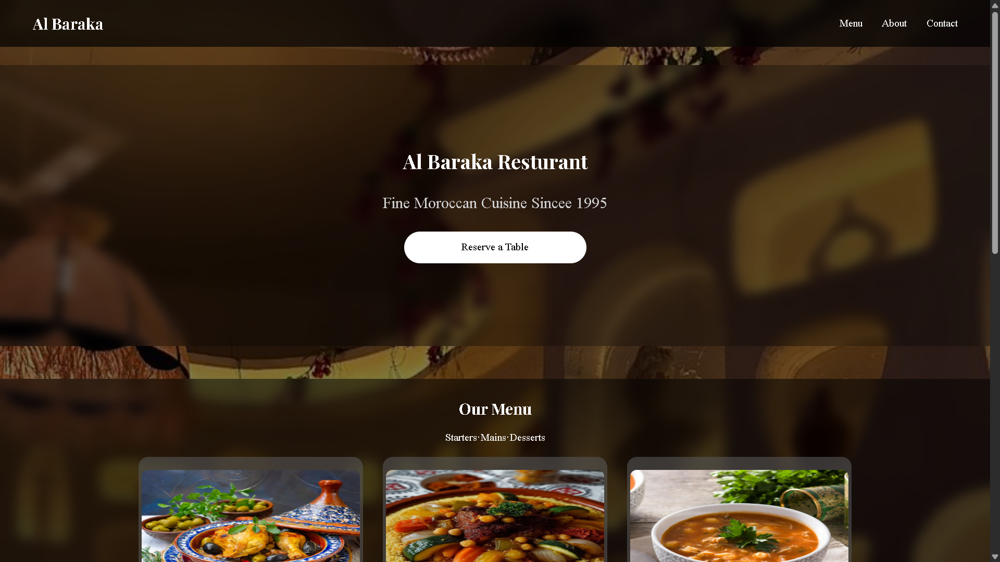

# Al Baraka Restaurant 🍽️

A modern and elegant restaurant website built with HTML, CSS & Vanilla JavaScript.
Designed to help Moroccan restaurants establish a professional online presence.

## Live Demo
🌐 [View Website](https://BlayzeX.github.io/Restaurant-website)

## Features
- Responsive design for all devices 📱
- Smooth scroll navigation
- Backdrop blur effects throughout
- Interactive menu cards with hover animations
- About section with restaurant story
- Contact section with location info
- Clean dark elegant aesthetic

## Built With
- HTML5
- CSS3
- Vanilla JavaScript

## Sections
- **Hero** — Full background with reservation CTA
- **Menu** — Food cards with images & prices
- **About** — Restaurant story & photo
- **Contact** — Phone, address & directions
- **Footer** — Copyright info

## Preview

---
*Built as a template for Moroccan restaurants looking to establish their online presence.*
